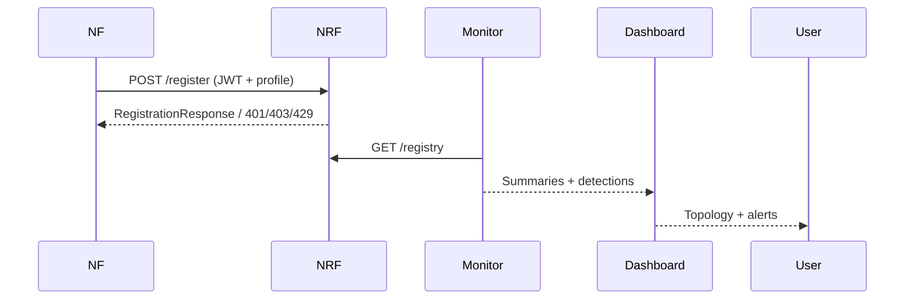

# Architecture Overview

The lab emulates a 5G SBA control plane using lightweight FastAPI services. Each Network Function
(NF) self-registers with the Network Repository Function (NRF) using JWT-based attestation.

## Components
- **NRF**: Central registry with allow-list enforcement, rate limiting, JWT validation, and audit logging.
- **NFs**: Mock AMF/SMF/AUSF/UDM/PCF/UPF/NSSF built on a shared NF service base with schema + slice guards.
- **Attacks**: Scripts that attempt unsafe registrations or malformed payloads (simulated only) to validate controls.
- **Defences**: Middleware enforcing attestation, optional mTLS semantics, schema validation, and slice allow-lists.
- **Monitoring**: Registry analysis utilities, slice analyzers, and JSONL sniffer for replaying events.
- **Dashboard**: Static HTML/CSS/JS visualizer of topology and alerts.

## Data flows
1. NF boots, constructs an attestation JWT, and POSTs `/register` to the NRF.
2. NRF validates the token, checks allow-lists, applies per-instance rate limits, and stores the NF profile in memory.
3. Monitoring jobs inspect the registry for anomalies (low trust, duplicate endpoints, slice misuse).
4. Attack scripts attempt to bypass defences; NRF and NF endpoints return actionable error details and warnings.
5. Dashboard renders topology and alerts using simulated data or future API integrations.

## Security posture
- **Identity**: JWT attestation with pluggable secret; mTLS simulated via header requirement; optional slice allow-lists.
- **Policy**: Allow-listed NF types and per-instance rate limiting to reduce registration abuse and DoS surfaces.
- **Observability**: Rich logging and JSONL captures for offline analysis; monitoring utilities highlight anomalies.
- **Safety**: No radio, no real network calls, and all services run inside the lab boundary.

## Trust boundaries
- **Control-plane LAN**: All NFs and NRF communicate here; protected by shared secret and optional mTLS flag.
- **Attack sandbox**: Attack modules use the same network but are isolated to container network namespaces.
- **Dashboard/UI**: Purely static assets; no privileged operations.
